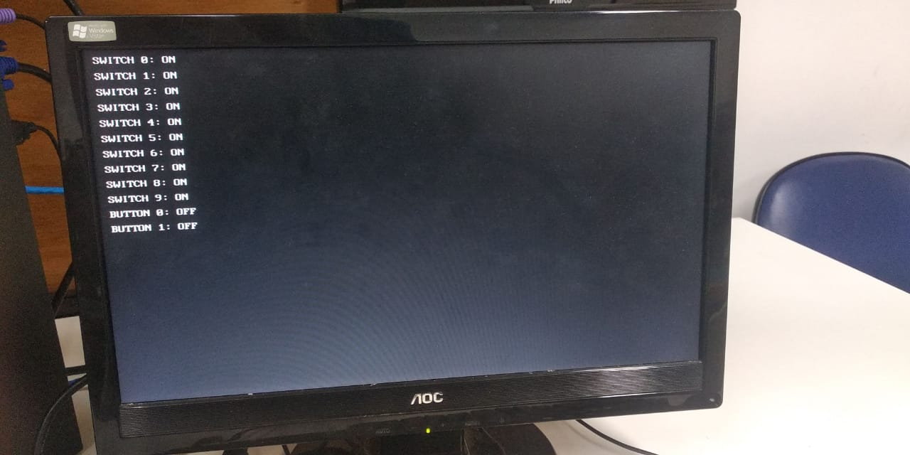

# VGA-FPGA-Screen

## Descrição

Esse projeto é baseado no código [VGA-Text-Generator](https://github.com/Derek-X-Wang/VGA-Text-Generator). Para que fosse possível utilizar estes módulos, foi-se necessário criar um código verilog que interaja com eles.

Ele faz parte de um projeto avaliativo que será apresentado na aula de Sistemas Embarcados no curso de Engenharia da Computação do IFF-Campos.

O código envia para um monitor conectado à saída VGA do FPGA, textos que refletem as ações ao pressionar botões na placa com a função de ser uma suite de testes.

## Arquivos

* `vga_sceen.v`: Arquivo principal, responsável por enviar os sinais ao VGA após se
comunicar com `wrapper.vhd`, tendo o resultado de se o pixel naquela determinada
posição deve ser ativado.
* `Font_Rom.vhd`: Este módulo armazena todos os dados de caracteres do ASCII 0-127. Basicamente, é uma matriz longa que contém todos os caracteres. Cada caractere contém 8 * 16 pixels. O módulo retorna uma linha de caractere com base no
endereço de entrada.
* `Pixel_On_Text.vhd`: Este módulo verifica se a posição atual está sobre um pixel do
texto.
* `commonPak.vhd`: Este arquivo contém muitas constantes para o projeto, como
FONT_WIDTH, FONT_HEIGHT e alguma estrutura de dados, como point_2d.
* `wrapper.vhd`: Este é um wrapper para usar o `Pixel_On_Text.vhd` no Verilog.

## Funcionamento

### Caracteres (ASCII)

O texto é enviado para `Pixel_On_Text`. Baseado na posição atual da tela, é verificado qual caractere está sendo processado e é obtido o código que representa este caractere.
Após identificado a posição atual na tela, o endereço do caractere é enviado à `Font_Rom` que retorna uma array com quais pixels desta linha devem estar ativos. Por fim, `Pixel_On_Text` recebe essa array e verifica se a posição do pixel atual da tela deve estar acesa ou não. Se tiver, ele retornará o valor 1 para *res* do arquivo `wrapper`.

## Resultado Final

## Referências

* https://www.embarcados.com.br/controlador-vga-parte-1/
* https://github.com/Derek-X-Wang/VGA-Text-Generator
* https://www.digikey.com/eewiki/pages/viewpage.action?pageId=15925278
* https://timetoexplore.net/blog/video-timings-vga-720p-1080p
* https://ktln2.org/2018/01/23/implementing-vga-in-verilog/